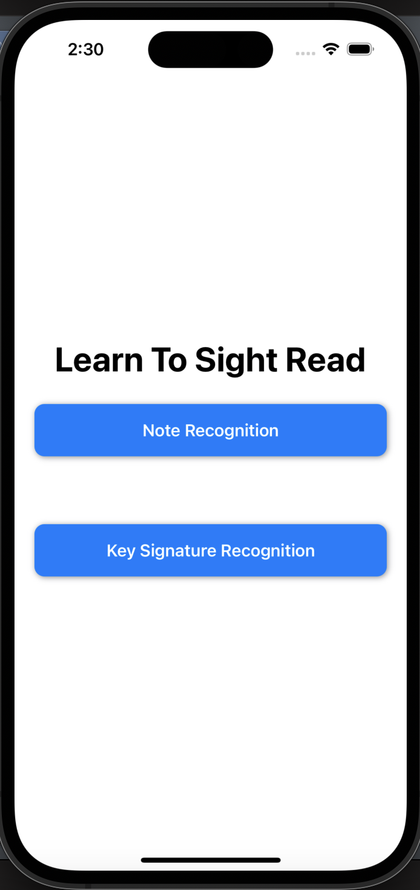
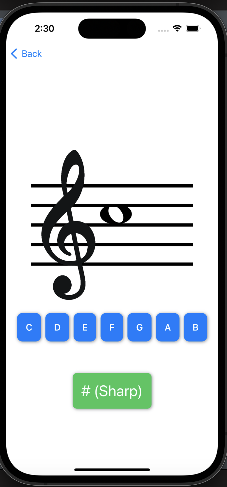
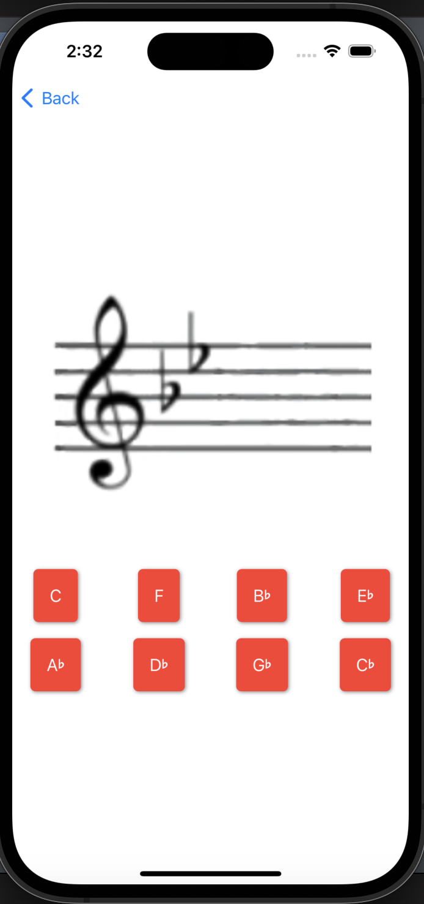

A lightweight iOS app that will teach you to sight read. 

What is sight reading? 
It's the ability to read sheet music. This app teachs both note recognition and key signature recognition in two basic clefs, treble and bass.

Home Screen:

Learn to recognise notes:

Learn to recogonise key signatures:
